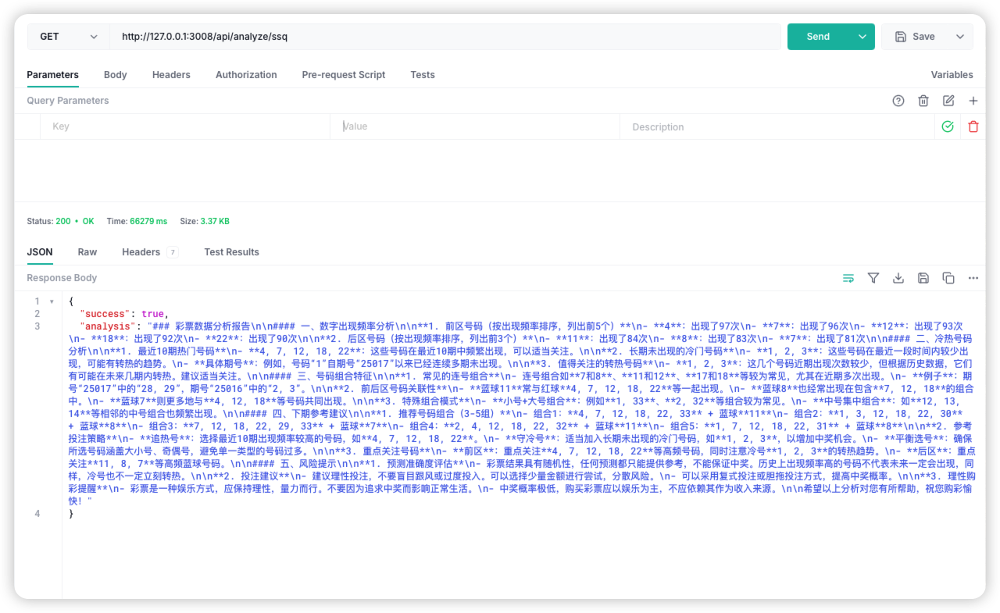

# LotteryMaster


### ✨ 主要功能 (Key Features)

- 📊 **数据处理**:  抓取彩票数据，保存到Excel文件。
- 🤖 **输出报告**:  集成通义千问大模型(Qwen-MAX)，根据prompt生成分析报告，包括号码预测、号码推荐、号码趋势等。
- 📱 **多端访问支持**:   支持Web、移动App等多平台访问，方便用户随时随地获取彩票分析信息。前端项目地址: [LotteryMaster-Uniapp](https://github.com/lifefloating/LotteryMaster-Uniapp)

## 🛠️ 技术栈 (Tech Stack)

- **后端开发**
  - <a href="https://www.fastify.io/"></a> 
<a href="https://nodejs.org/"></a> 
<a href="https://cheerio.js.org/"></a> 
<a href="https://www.npmjs.com/package/xlsx"></a>

- **AI 模型**
  - [通义千问 Qwen-MAX API](https://tongyi.aliyun.com/qianwen/):  阿里云大语言模型API，用于生成分析报告。
  
- **前端开发**
  - [LotteryMaster-Uniapp](https://github.com/lifefloating/LotteryMaster-Uniapp): 基于uniapp + Vue3 + TypeScript的多端应用

## 🚀 快速开始 (Quick Start)

### ⚙️ 环境要求 (Prerequisites)

- [Node.js](https://nodejs.org/en/download/):  版本 >= 18.0 (推荐使用最新LTS版本)
- [pnpm](https://pnpm.io/) 或 [yarn](https://yarnpkg.com/):  包管理器 (推荐使用pnpm)
- [通义千问 Qwen-MAX API Key](https://tongyi.aliyun.com/qianwen/):  需要开通阿里云通义千问服务并获取API密钥

### 👣 步骤 (Steps)

1. **克隆代码仓库 (Clone the repository)**
   ```bash
   git clone https://github.com/lifefloating/LotteryMaster
   cd LotteryMaster
   ```

2. **安装后端依赖 (Install backend dependencies)**
   ```bash
   pnpm install
   ```

3. **配置环境变量 (Configure environment variables)**

   在项目根目录下创建 `.env` 文件，并根据 `.env.example` 文件中的示例配置以下环境变量：

   ```env
   PORT=3008
   API_KEY=your_key
   ```

   其他的按需求调整配置

4. **运行服务 (Run backend service)**
   ```bash
    pnpm run start
   ```

   后端服务默认运行在 `http://localhost:3008`。

5. **运行前端项目**

   前端项目请参考 [LotteryMaster-Uniapp](https://github.com/lifefloating/LotteryMaster-Uniapp) 的 `README.md` 文件启动前端服务，并确保前端配置的后端API地址正确。

6. **docker运行**

   ```bash
   docker build -t lottery-master .
   docker run -d -p 3008:3008 --env PORT=3008 --env API_KEY=your_api_key lottery-master
   ```

   请替换 `your_api_key` 为您的 API 密钥。


### 🔗 访问API

后端服务启动后，您可以使用Postman、curl等工具访问API接口。

例如，访问健康检查接口：
```bash
curl http://localhost:3008/api/health
```

### 🖼️ 接口测试图



### 📝 TODO
  - 尝试切换deepseek或者其他的测试比较一下
  - 做成通用类型对，支持多种模型
  - 前端页面样式?交互?


文档将在后续继续完善。

---

**注意**:  本项目仍处于开发阶段，部分功能可能尚未完善。分析报告的结果仅供参考，不构成任何投资建议。请理性对待彩票，切勿沉迷。

如果您在使用过程中遇到任何问题，或者有任何建议，欢迎提交Issue或Pull Request。

<p align="center">
  <a href="https://github.com/Hubery-Lee/LotteryMaster/issues"></a>
  <a href="https://github.com/Hubery-Lee/LotteryMaster/pulls"></a>
  <a href="#"></a>
  <a href="#"></a>
</p>

